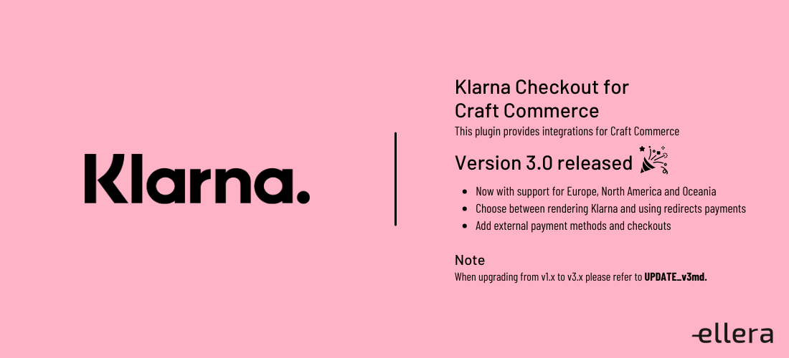

# ABANDONED
Unfortunately, this plugin is no longer maintained.


---



# Klarna Checkout for Craft Commerce

This plugin provides [Klarna](https://www.klarna.com) integrations for [Craft Commerce](https://craftcms.com/commerce).
# Version 3.0 released 🎉
- Now with support for Europe 🇪🇺 North America 🇺🇸 and Oceania 🇦🇺 !
- Choose between rendering Klarna and using redirect payments 
- Add external payment methods and checkouts

##Note:

**When upgrading from v1.x to v3.x please refer to [UPDATE_v3.md](UPDATE_v3.md)**.
## Requirements

This plugin requires Craft Commerce 3.0.0 or later.

## Installation

You can install this plugin from the Plugin Store.

#### From the Plugin Store

Go to the Plugin Store in your project’s Control Panel and search for “Klarna Checkout”. Then click on the “Install” button in its modal window.

## Support

Contact us on support@ellera.no or create a new issue in [GitHub](https://github.com/elleracompany/commerce-klarna-checkout/issues).

You can also reach us by messaging @Jorgen on Discord.


The plugin logs errors and transactions to `@storage/logs/klarna-checkout.log` or `@storage/logs/klarna-hpp.log`. Please provide the relevant logs when reaching out.

## Setup

1.  Make sure you have set the store location in `Commerce -> Store Settings -> Store Location`
2.  and Base URL in `Settings -> Sites -> sitename -> Base URL`.
3.  Install the plugin.
4.  Navigate to `Commerce -> System Settings -> Gateways` and `+ New Gateway`
5.  Select Klarna Checkout or Klarna Hosted Payment Page from the dropdown.
6.  Set your information Playground credentials in API Credentials Europe Test Username (UID)/Test Password.
7.  Get Klarna Production Approval for your site
8.  Turn off "Testing Mode" and add production credentials for the Gateway


#### Klarna Checkout: Payment button
Since Klarna Checkout is rendering its own payment button, the craft-commerce default 'Pay' button must be removed.
You can copy and overwrite your shop default `checkout/payment.html` file with `vendor/ellera/commerce-klarna-checkout/src/templates/pages/checkout/payment.html` or simply update your existing template with
```

    <button class="button button-primary" type="submit">Pay {{ cart.totalPrice|commerceCurrency(cart.paymentCurrency,convert=true) }}</button>

```
#### Klarna Hosted Payment Page
For hosted payment pages the 'Pay' button is required to send the user to Klarna. When selecting Logo and Background images 
for Klarna HPP it is important that the Image asset is in a web accessible Volume.
 
#### Get Klarna Approval
You need approval from klarna before you can change to production mode.

#### Klarna Order Complete HTML
To render the Klarna Order Complete HTML you can use this code in your `shop/customer/order` template:
```
    
        {{ order.gateway.getHtml(order.id)|raw }}
    
        // Regular thank-you-page
    
```

*Note: The Klarna OrderID is stored in the PHP session and the HTML is fetched from Klarna APIs. `order.gateway.hasHtml` will check that the session exist, and if not you can render the regular thank-you-page.*
#### VAT and Taxes

Klarna requires tax to be sent per order line, not on the order in total, so for VAT and Taxes to be passed along to Klarna correctly, the taxable subject must be set to "Line item price".
If the shipping cost is taxable as well, you need to create a separate tax rate for shipping and set that to "Order total shipping cost"

#### Using environment variables
UID, Password and Test Mode options can be controlled with environment variables.
Add environment variables to your .env files and reference them in the settings page (Read more in the [documentation](https://docs.craftcms.com/v3/config/environments.html#control-panel-settings)).

The Test Mode setting can also be controlled with an environment variable, but this format is strict.
Use `KLARNA_TEST_MODE_<handle>` where <handle> is the gateway handle.

Example .env:
```
# Klarna
KLARNA_TEST_UID="PKXXX_XXXXXXXXXX"
KLARNA_TEST_PWD="XXXXXXXXXXXXXX"
KLARNA_PROD_UID="PKXXX_XXXXXXXXXX"
KLARNA_PROD_PWD="XXXXXXXXXXXXXX"
KLARNA_TEST_MODE_klarnaCheckout="true"
```

### Formatting / changing the address
If your set-up uses different fields for the addresses in Commerce, for instance when you store the house number separately from the streetname, you can hook into the address formatter to change the format before it gets sent to Klarna.

The FormatAddressEvent contains two parameters, the `address` parameter that contains the formatted address and the `sourceAddress`, which contains the source Address model.
```
    use ellera\commerce\klarna\gateways\Base as KlarnaGateway;
    
    Event::on(
        KlarnaGateway::class,
        KlarnaGateway::EVENT_FORMAT_ADDRESS,
        function(FormatAddressEvent $event) {
            $event->address['street_address'] = "{$event->sourceAddress->address1} {$event->sourceAddress->address3}";
        }
    );
```
## Troubleshooting

#### I get 401 or 403 response when I turn off Test Mode
You need approval from Klarna before your account is approved for production.

Look for the "Resume onboarding" link under the menu on https://eu.portal.klarna.com/

## Development

- Add support for project sync (project.yaml)
